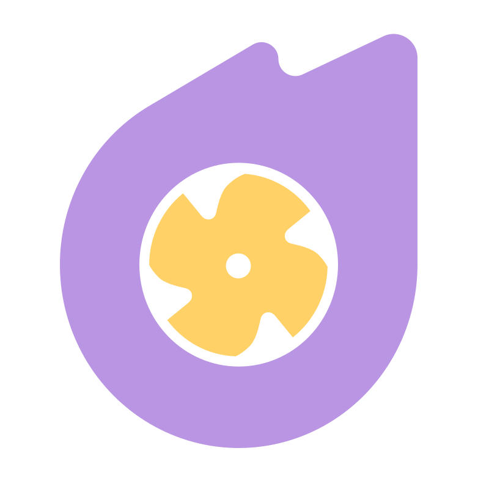
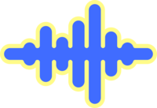
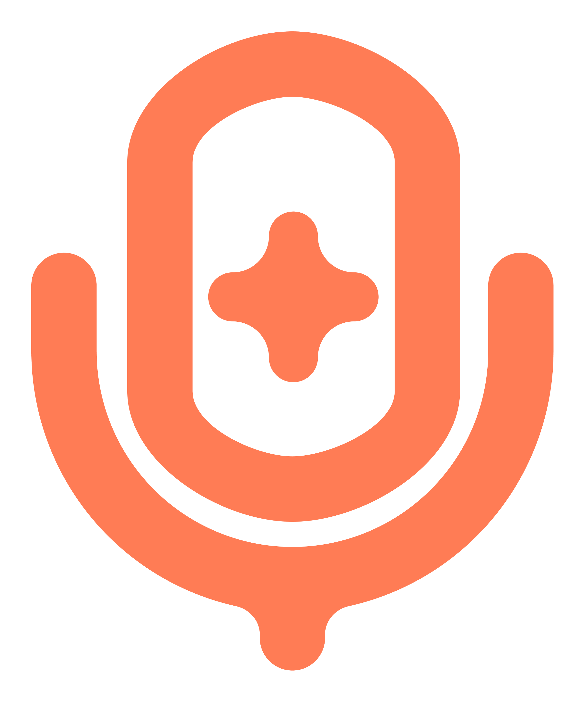

  

  

    <em>Electronic engineering student & digital artist from Malaysia 🇲🇾</em>
  

  

    
    
  

---

hey! i'm ashe. i'm an electronic engineering student from malaysia and also a digital artist.

when i'm not studying circuits or drawing, i like building tiny, native desktop tools for windows in rust and c#.

aesthetic + bloatfree software.

---

### 📦 creme family

<table align="center" width="100%">
  <tr>
    <td width="50%" align="center" valign="top">
       
      
      <h3 align="center"><a href="https://github.com/asheohto/cremecore">Cremecore</a></h3>
      

        
        
        
      

      
Lightweight fan controller & telemetry daemon for HP Omen/Victus laptops. Built in Rust with Freya GUI so I don't have to keep Omen Gaming Hub open.

    </td>
    <td width="50%" align="center" valign="top">
       
      
      <h3 align="center"><a href="https://github.com/asheohto/cremey">Cremey</a></h3>
      

        
        
        
      

      
SteelSeries Sonar annihilator. Disables unwanted Sonar virtual audio endpoints on boot in 3 seconds, then shuts down completely. 0 MB idle RAM.

    </td>
  </tr>
  <tr>
    <td width="50%" align="center" valign="top">
       
      
      <h3 align="center"><a href="https://github.com/asheohto/lyricreme">Lyricreme</a></h3>
      

        
        
        
      

      
Transparent, click-through desktop lyric overlay for Windows. Hooks into Pear Desktop & Tuna to auto-scroll synchronized lyrics on playback.

    </td>
    <td width="50%" align="center" valign="top">
       
      
      <h3 align="center"><a href="https://github.com/asheohto/cremevox">Cremevox</a></h3>
      

        
        
      

      
Lightweight audio utility with built-in AI noise cancellation, microphone enhancement tools, and real-time voice processing.

    </td>
  </tr>
</table>

---

### 🛠️ toolbox

  **Languages** 
  
  
  
  

    

  **Systems & Low-Level** 
  
  
  
  

    

  **Environment** 
  
  
  
  

---

### 🔥 streak & activity

  

---

[ko-fi](https://ko-fi.com/omoretti) &nbsp;•&nbsp; [github](https://github.com/asheohto) &nbsp;•&nbsp; [ashloveaiohto@gmail.com](mailto:ashloveaiohto@gmail.com)

